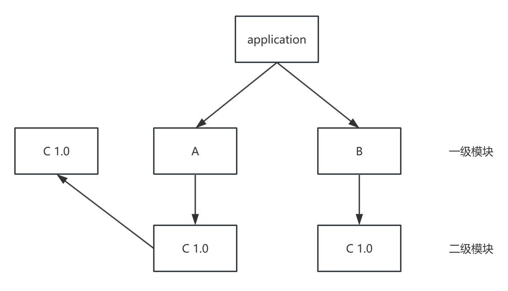
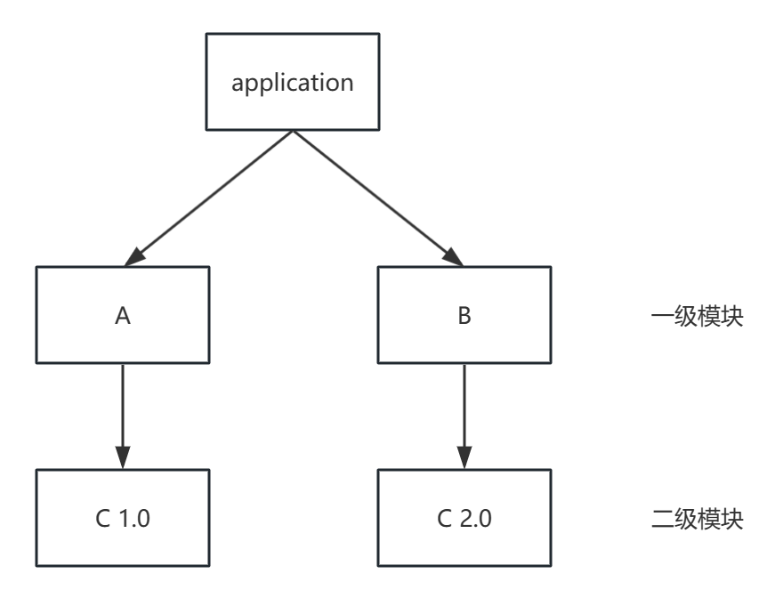
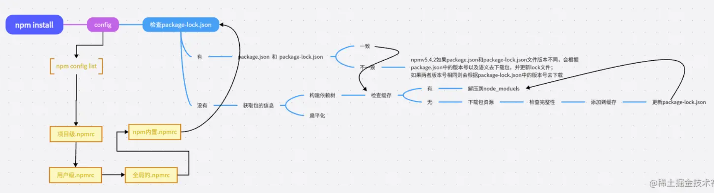

# Node JS

## 概述

Nodejs 是 JavaScript 的运行时。

Node.js，或者 Node，是一个可以让 JavaScript 运行在服务器端的平台。它可以让 JavaScript 脱离浏览器的束缚运行在一般的服务器环境下，就像运行 Python、Perl、PHP、Ruby 程序一样。你可以用 Node.js 轻松地进行服务器端应用开发，Python、Perl、PHP、Ruby 能做的事情 Node.js 几乎都能做，而且可以做得更好。

Nodejs 是构建在 V8 引擎之上的，V8 引擎是由 C/C++ 编写的，因此我们的 JavaSCript 代码需要由 C/C++ 转化后再执行。

NodeJs 使用异步 I/O 和事件驱动的设计理念，可以高效地处理大量并发请求，提供了非阻塞式 I/O 接口和事件循环机制，使得开发人员可以编写高性能、可扩展的应用程序,异步 I/O 最终都是由 libuv 事件循环库去实现的。

nodejs 适合干一些 IO 密集型应用，不适合 CPU 密集型应用，nodejsIO 依靠 libuv 有很强的处理能力，而 CPU 因为 nodejs 单线程原因，容易造成 CPU 占用率高，如果非要做 CPU 密集型应用，可以使用 C++ 插件编写或者 nodejs 提供的 cluster。( CPU 密集型指的是图像的处理 或者音频处理需要大量数据结构 + 算法)

正如 JavaScript 为客户端而生，Node.js 为网络而生。Node.js 能做的远不止开发一个网站那么简单，使用 Node.js，你可以轻松地开发：

- 具有复杂逻辑的网站；
- 基于社交网络的大规模 Web 应用；
- Web Socket 服务器；
- TCP/UDP 套接字应用程序；
- 命令行工具；
- 交互式终端程序；
- 带有图形用户界面的本地应用程序；
- 单元测试工具；
- 客户端 JavaScript 编译器。

Node.js 内建了 HTTP 服务器支持，也就是说你可以轻而易举地实现一个网站和服务器的组合。这和 PHP、Perl 不一样，因为在使用 PHP 的时候，必须先搭建一个 Apache 之类的 HTTP 服务器，然后通过 HTTP 服务器的模块加载或 CGI 调用，才能将 PHP 脚本的执行结果呈现给用户。而当你使用 Node.js 时，不用额外搭建一个 HTTP 服务器，因为 Node.js 本身就内建了一个。这个服务器不仅可以用来调试代码，而且它本身就可以部署到产品环境，它的性能足以满足要求。

Node.js 还可以部署到非网络应用的环境下，比如一个命令行工具。Node.js 还可以调用 C/C++ 的代码，这样可以充分利用已有的诸多函数库，也可以将对性能要求非常高的部分用 C/C++ 来实现。

## 安装 nodejs

访问官网

en nodejs.org/en

cn www.nodejs.com.cn/

## 什么是 npm

npm（全称 Node Package Manager）是 Node.js 的包管理工具，它是一个基于命令行的工具，用于帮助开发者在自己的项目中安装、升级、移除和管理依赖项。
www.npmjs.com/

类似于 PHP 的工具：Composer。它是 PHP 的包管理器，可以用于下载、安装和管理 PHP 的依赖项，类似于 npm。
类似于 Java 的工具：Maven。它是 Java 的构建工具和项目管理工具，可以自动化构建、测试和部署 Java 应用程序，类似于 npm 和 webpack 的功能。
类似于 Python 的工具：pip。它是 Python 的包管理器，可以用于安装和管理 Python 的依赖项，类似于 npm。
类似于 Rust 的工具：Cargo。它是 Rust 的包管理器和构建工具，可以用于下载、编译和管理 Rust 的依赖项，类似于 npm 和 Maven 的功能。

## package.json

在每个前端项目中，都有 package.json 文件，它是项目的配置文件，常见的配置有配置项目启动、打包命令，声明依赖包等。package.json 文件是一个 JSON 对象，该对象的每一个成员就是当前项目的一项设置。

执行 `npm init` 便可以初始化一个 package.json 文件

```json
// package.json
{
  "name": "demo",
  "version": "1.0.0",
  "description": "",
  "main": "index.js",
  "scripts": {
    "test": "echo 'holle'"
  },
  "keywords": [],
  "author": "",
  "license": "ISC",
  "devDependencies": {},
  "dependencies": {}
}
```

- `name`：项目名称，必须是唯一的字符串，通常采用小写字母和连字符的组合。
- `version`：项目版本号，通常采用语义化版本号规范。
- `description`：项目描述。
- `main`：项目的主入口文件路径，通常是一个 JavaScript 文件。
- `keywords`：项目的关键字列表，方便他人搜索和发现该项目。
- `author`：项目作者的信息，包括姓名、邮箱、网址等。
- `license`：项目的许可证类型，可以是自定义的许可证类型或者常见的开源许可证（如 MIT、Apache 等）。
- `dependencies`：项目所依赖的包的列表，这些包会在项目运行时自动安装。
- `devDependencies`：项目开发过程中所需要的包的列表，这些包不会随项目一起发布，而是只在开发时使用。
- `peerDependencies`：项目的同级依赖，即项目所需要的模块被其他模块所依赖。
- `scripts`：定义了一些脚本命令，比如启动项目、运行测试等。
- `repository`：项目代码仓库的信息，包括类型、网址等。
- `bugs`：项目的 bug(臭虫) 报告地址。
- `homepage`：项目的官方网站地址或者文档地址。

## npm install 原理

首先安装的依赖都会存放在根目录的 `node_modules` 文件夹下,默认采用 `扁平化` 的方式安装，并且排序规则。`.bin` 第一个然后 `@` 系列，再然后按照首字母进行升序排序如 `abcd` ，并且使用的算法是广度优先遍历，在遍历依赖树时，npm 会首先处理项目根目录下的依赖，然后逐层处理每个依赖包的依赖，直到所有依赖都被处理完毕。在处理每个依赖时，npm 会检查该依赖的版本号是否符合依赖树中其他依赖的版本要求，如果不符合，则会尝试安装适合的版本

### 扁平化

扁平化只在理想状态下:



安装某个二级模块时，若发现第一层级有相同名称，相同版本的模块，便直接复用那个模块

因为 A 模块下的 C 模块被安装到了第一级，这使得 B 模块能够复用处在同一级下；且名称，版本，均相同的 C 模块

非理想状态下:



因为 B 和 A 所要求的依赖模块不同，（B 下要求是 v2.0 的 C，A 下要求是 v1.0 的 C ）所以 B 不能像 2 中那样复用 A 下的 C v1.0 模块 所以如果这种情况还是会出现模块冗余的情况，他就会给 B 继续搞一层 node_modules，就是非扁平化了。

### npm install 后续流程



## npm run 原理

读取 package json 的 scripts 对应的脚本命令(dev:vite),vite 是个可执行脚本，他的查找规则是：

- 先从当前项目的 node_modules/.bin 去查找可执行命令 vite
- 如果没找到就去全局的 node_modules 去找可执行命令 vite
- 如果还没找到就去环境变量查找
- 再找不到就进行报错

### npm 生命周期

没想到吧 npm 执行命令也有生命周期！！！

```json
"predev": "node prev.js",
"dev": "node index.js",
"postdev": "node post.js"
```

执行 npm run dev 命令的时候 predev 会自动执行 他的生命周期是在 dev 之前执行，然后执行 dev 命令，再然后执行 postdev，也就是 dev 之后执行
运用场景例如 npm run build 可以在打包之后删除 dist 目录等等
post 例如你编写完一个工具发布 npm，那就可以在之后写一个 ci 脚本顺便帮你推送到 git 等等

## npx

npx 是一个命令行工具，它是 npm 5.2.0 版本中新增的功能。它允许用户在不安装全局包的情况下，运行已安装在本地项目中的包或者远程仓库中的包。

npx 的作用是在命令行中运行 node 包中的可执行文件，而不需要全局安装这些包。这可以使开发人员更轻松地管理包的依赖关系，并且可以避免全局污染的问题。它还可以帮助开发人员在项目中使用不同版本的包，而不会出现版本冲突的问题。
npx 的优势

- 避免全局安装：npx 允许你执行 npm package，而不需要你先全局安装它。
- 总是使用最新版本：如果你没有在本地安装相应的 npm package，npx 会从 npm 的 package 仓库中下载并使用最新版。
- 执行任意 npm 包：npx 不仅可以执行在 package.json 的 scripts 部分定义的命令，还可以执行任何 npm package。
- 执行 GitHub gist：npx 甚至可以执行 GitHub gist 或者其他公开的 JavaScript 文件。

### npm 和 npx 的区别

npx 侧重于执行命令的，执行某个模块命令。虽然会自动安装模块，但是重在执行某个命令

npm 侧重于安装或者卸载某个模块的。重在安装，并不具备执行某个模块的功能。

## npm 包发布

npm 包好处：

- 方便团队或者跨团队共享代码，使用 npm 包就可以方便的管理，并且还可以进行版本控制

- 做开源造轮子必备技术，否则你做完的轮子如何让别人使用

- 面试可能会问到这个

- 体现个人价值，让更多的人知道你的技术能力

### 发布流程

- 准备一个 npm 账号
- 检查镜像源，必需是官方的！
- npm login 登陆账号
- npm init 初始化一个项目
- 配置好 package.json 文件
- npm publish 发布

## npm 私服

- 可以离线使用，将 npm 私服部署到内网集群，这样离线也可以访问私有的包。

- 提高包的安全性，使用私有的 npm 仓库可以更好的管理你的包，避免在使用公共的 npm 包的时候出现漏洞。

- 提高包的下载速度，使用私有 npm 仓库，你可以将经常使用的 npm 包缓存到本地，从而显著提高包的下载速度，减少依赖包的下载时间。这对于团队内部开发和持续集成、部署等场景非常有用

[Verdaccio](https://link.juejin.cn/?target=https%3A%2F%2Fverdaccio.org%2Fzh-CN%2F) 是可以帮我们快速构建 npm 私服的一个工具

```sh
npm install verdaccio -g
```

### 运行

::: code-group

```sh [默认4873端口云]
verdaccio
```

```sh [指定端口运行]
verdaccio --listen 9000
```

:::

可在 http://localhost:4873 管理私服

## 模块化

Nodejs 模块化规范遵循 CommonJS 规范与 esm 规范

### CommonJS 规范

引入模块

1、支持引入内置模块例如 http os fs child_process 等 nodejs 内置模块
2、支持引入第三方模块 express md5 koa 等
3、支持引入自己编写的模块 ./ ../ 等
3、支持引入 addon C++扩展模块 .node 文件

```js
const fs = require("node:fs"); // 导入核心模块
const express = require("express"); // 导入 node_modules 目录下的模块
const myModule = require("./myModule.js"); // 导入相对路径下的模块
const nodeModule = require("./myModule.node"); // 导入扩展模块
```

导出模块

`exports` 和 `module.exports`

```js
exports const a = "a";

module.exports = {
  hello: "hello"
};
```

也可以直接导出值 `module.exports = 1`

### ESM 模块化规范

ESM 模块化规范，是浏览器和服务器通用的模块化规范，在浏览器和服务器都可以使用,使用 ESM 模块的时候必须设置 package.json 设置 type:module

引入模块

1、支持引入内置模块例如 http os fs child_process 等 nodejs 内置模块
2、支持引入第三方模块 express md5 koa 等
3、支持引入自己编写的模块 ./ ../ 等

```js
import fs from "node:fs";
import express from "express";
import myModule from "./myModule.js";
import nodeModule from "./myModule.node";
```

模块导出

`export` 或 `export default`

```js
export const a = "a";

export default {
  hello: "hello",
};
```

### 区别

1、CommonJS 规范在服务器端运行，esm 模块化规范在浏览器端运行
2、CommonJS 规范是动态加载，esm 模块化规范是静态加载
3、CommonJS 是基于运行时的同步加载，esm 是基于编译时的异步加载
4、CommonJS 是可以修改值的，esm 值并且不可修改（可读的）
5、CommonJS 不可以 tree shaking，esm 支持 tree shaking
6、CommonJS 中顶层的 this 指向这个模块本身，而 ES6 中顶层 this 指向 undefined

## 全局变量与全局 API

如何在 nodejs 定义全局变量呢？

在 nodejs 中使用 global 定义全局变量，定义的变量，可以在引入的文件中也可以访问到该变量，例如 a.js global.xxx = 'xxx' require('xxx.js') xxx.js 也可以访问到该变量，在浏览器中我们定义的全局变量都在 window,nodejs 在 global，不同的环境还需要判断，于是在 ECMAScript 2020 出现了一个 globalThis 全局变量，在 nodejs 环境会自动切换成 global ，浏览器环境自动切换 window 非常方便
关于其他全局 API

> 由于 nodejs 中没有 DOM 和 BOM，除了这些 API，其他的 ECMAscriptAPI 基本都能用

例如这些 API 都是可以正常用的

```js
setTimeout setInterval Promise Math  console  Date fetch(node v18)
```

### nodejs 内置全局 API

- `__dirname` 它表示当前模块的所在目录的绝对路径
- `__filename` 它表示当前模块文件的绝对路径，包括文件名和文件扩展名
- `require` module 引入模块和模块导出上一章已经详细讲过了

......

## CSR SSR SEO

在 node 环境中无法操作 DOM 和 BOM，但是如果非要操作 DOM 和 BOM 也是可以的我们需要使用第三方库帮助我们 jsdom

```sh
npm i jsdom
```

jsdom 是一个模拟浏览器环境的库，可以在 Node.js 中使用 DOM API

### 案例

```js
const fs = require("node:fs");
const { JSDOM } = require("jsdom");

const dom = new JSDOM(`<!DOCTYPE html><div id='app'></div>`);

const document = dom.window.document;

const window = dom.window;

fetch("https://api.thecatapi.com/v1/images/search?limit=10&page=1")
  .then((res) => res.json())
  .then((data) => {
    const app = document.getElementById("app");
    data.forEach((item) => {
      const img = document.createElement("img");
      img.src = item.url;
      img.style.width = "200px";
      img.style.height = "200px";
      app.appendChild(img);
    });
    fs.writeFileSync("./index.html", dom.serialize());
  });
```

### CSR SSR

我们上面的操作属于 SSR （Server-Side Rendering）服务端渲染请求数据和拼装都在服务端完成，而我们的 Vue,react 等框架这里不谈(nuxtjs,nextjs)，是在客户端完成渲染拼接的属于 CSR（Client-Side Rendering）客户端渲染

### CSR 和 SSR 区别

页面加载方式：

- CSR：在 CSR 中，服务器返回一个初始的 HTML 页面，然后浏览器下载并执行 JavaScript 文件，JavaScript 负责动态生成并更新页面内容。这意味着初始页面加载时，内容较少，页面结构和样式可能存在一定的延迟。
- SSR：在 SSR 中，服务器在返回给浏览器之前，会预先在服务器端生成完整的 HTML 页面，包含了初始的页面内容。浏览器接收到的是已经渲染好的 HTML 页面，因此初始加载的速度较快。

内容生成和渲染：

- CSR：在 CSR 中，页面的内容生成和渲染是由客户端的 JavaScript 脚本负责的。当数据变化时，JavaScript 会重新生成并更新 DOM，从而实现内容的动态变化。这种方式使得前端开发更加灵活，可以创建复杂的交互和动画效果。
- SSR：在 SSR 中，服务器在渲染页面时会执行应用程序的代码，并生成最终的 HTML 页面。这意味着页面的初始内容是由服务器生成的，对于一些静态或少变的内容，可以提供更好的首次加载性能。

用户交互和体验：

- CSR：在 CSR 中，一旦初始页面加载完成，后续的用户交互通常是通过 AJAX 或 WebSocket 与服务器进行数据交互，然后通过 JavaScript 更新页面内容。这种方式可以提供更快的页面切换和响应速度，但对于搜索引擎爬虫和 SEO（搜索引擎优化）来说，可能需要一些额外的处理。
- SSR：在 SSR 中，由于页面的初始内容是由服务器生成的，因此用户交互可以直接在服务器上执行，然后服务器返回更新后的页面。这样可以提供更好的首次加载性能和对搜索引擎友好的内容。

### SEO

CSR 应用对 SEO（Search Engine Optimization，搜索引擎优化）并不是很友好

因为在首次加载的时候获取 HTML 信息较少 搜索引擎爬虫可能无法获取完整的页面内容

而 SSR 就不一样了 由于 SSR 在服务器端预先生成完整的 HTML 页面，搜索引擎爬虫可以直接获取到完整的页面内容。这有助于搜索引擎正确理解和评估页面的内容

说了这么多哪些网站适合做 CSR 哪些适合做 SSR

CSR 应用例如 ToB 后台管理系统 大屏可视化 都可以采用 CSR 渲染不需要很高的 SEO 支持

SSR 应用例如 内容密集型应用大部分是 ToC 新闻网站 ，博客网站，电子商务，门户网站需要更高的 SEO 支持

## node 核心模块

### Buffer

### Child processes

### Cluster

### Crypto

### File System

### Http Https Http/2

### Net

### OS

### Path

### UDP

### Zlib

## node 模块加载机制

Node.js 的模块可以分为两大类，一类是核心模块，另一类是文件模块。核心模块就是 Node.js 标准 API 中提供的模块，如 fs、http、net、vm 等，这些都是由 Node.js 官方提供的模块，编译成了二进制代码。我们可以直接通过 require 获取核心模块，例如 require('fs')。核心模块拥有最高的加载优先级，换言之如果有模块与其命名冲突， Node.js 总是会加载核心模块。

文件模块则是存储为单独的文件（或文件夹）的模块，可能是 JavaScript 代码、JSON 或编译好的 C/C++ 代码。文件模块的加载方法相对复杂，但十分灵活，尤其是和 npm 结合使用时。在不显式指定文件模块扩展名的时候，Node.js 会分别试图加上 .js、.json 和 .node 扩展名。.js 是 JavaScript 代码，.json 是 JSON 格式的文本，.node 是编译好的 C/C++ 代码。

### 按路径加载模块

文件模块的加载有两种方式，一种是按路径加载，一种是查找 node_modules 文件夹。如果 require 参数以“ / ”开头，那么就以绝对路径的方式查找模块名称，例如 require ('/home/byvoid/module') 将会按照优先级依次尝试加载 /home/byvoid/module.js、/home/byvoid/module.json 和 /home/byvoid/module.node。

如果 require 参数以“ ./ ”或“ ../ ”开头，那么则以相对路径的方式来查找模块，这种方式在应用中是最常见的。例如前面的例子中我们用了 require('./hello')来加载同一文件夹下的 hello.js。

### 通过查找 node_modules 目录加载模块

如果 require 参数不以“ / ”、“ ./ ”或“ ../ ”开头，而该模块又不是核心模块，那么就要通过查找 node_modules 加载模块了。我们使用 npm 获取的包通常就是以这种方式加载的。在某个目录下执行命令 npm install express，你会发现出现了一个叫做 node_modules 的目录

在 node_modules 目录的外面一层，我们可以直接使用 require('express') 来代替 require('./node_modules/express')。这是 Node.js 模块加载的一个重要特性：通过查找 node_modules 目录来加载模块。

当 require 遇到一个既不是核心模块，又不是以路径形式表示的模块名称时，会试图在当前目录下的 node_modules 目录中来查找是不是有这样一个模块。如果没有找到，则会在当前目录的上一层中的 node_modules 目录中继续查找，反复执行这一过程，直到遇到根目录为止。举个例子，我们要在 /home/byvoid/develop/foo.js 中使用 require('bar.js') 命令，Node.js 会依次查找：

- /home/byvoid/develop/node_modules/bar.js
- /home/byvoid/node_modules/bar.js
- /home/node_modules/bar.js
- /node_modules/bar.js

为什么要这样做呢？因为通常一个工程内会有一些子目录，当子目录内的文件需要访问
到工程共同依赖的模块时，就需要向父目录上溯了。

我们不仅要在 project 目录下的 app.js 中使用 require('express')，而且可能要在 controllers 子目录下的 index_controller.js 中也使用 require('express')，这时就需要向父目录上溯一层才能找到 node_modules 中的 express 了。

### 加载缓存

我们在前面提到过，Node.js 模块不会被重复加载，这是因为 Node.js 通过文件名缓存所有加载过的文件模块，所以以后再访问到时就不会重新加载了。注意，Node.js 是根据实际文件名缓存的，而不是 require() 提供的参数缓存的，也就是说即使你分别通过 require('express') 和 require('./node_modules/express') 加载两次，也不会重复加载，因为尽管两次参数不同，解析到的文件却是同一个。

### 加载顺序

下面总结一下使用 require(some_module) 时的加载顺序。

(1) 如果 some_module 是一个核心模块，直接加载，结束。

(2) 如果 some_module 以“ / ”、“ ./ ”或“ ../ ”开头，按路径加载 some_module，结束。

(3) 假设当前目录为 current_dir，按路径加载 current_dir/node_modules/some_module。

- 如果加载成功，结束。
- 如果加载失败，令 current_dir 为其父目录。
- 重复这一过程，直到遇到根目录，抛出异常，结束。
